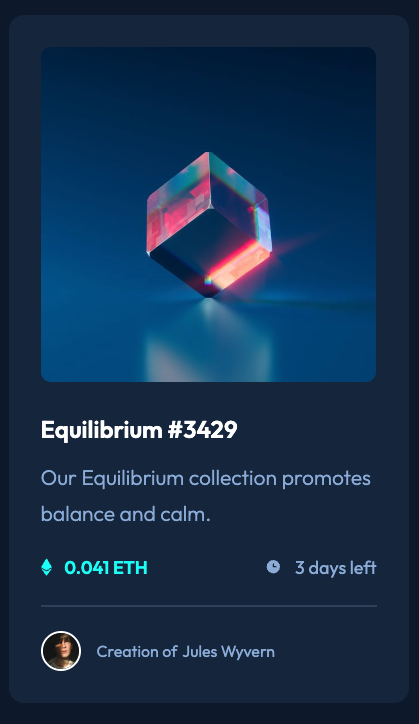

# Frontend Mentor - NFT preview card component

## Welcome! 👋

Thanks for checking out this front-end coding challenge.

[Frontend Mentor](https://www.frontendmentor.io) challenges help you improve your coding skills by building realistic projects.

# Frontend Mentor - Intro component with sign up form

### Screenshot

### Links

- Solution URL: [Github Code](https://github.com/lastiwan89/fem-NFT-preview-card)
- Live Site URL: [Netlify](https://64d61016ca4ca44ec0408a57--curious-lebkuchen-37d8d2.netlify.app/)

## My process

### Built with

- Semantic HTML5 markup
- Sass

## Author

- Frontend Mentor - [@yourusername](https://www.frontendmentor.io/profile/lastiwan89)

## Acknowledgments

Feel free to comment me in frontendmentor. and please give me feedback to improve

**Have fun building!** 🚀
